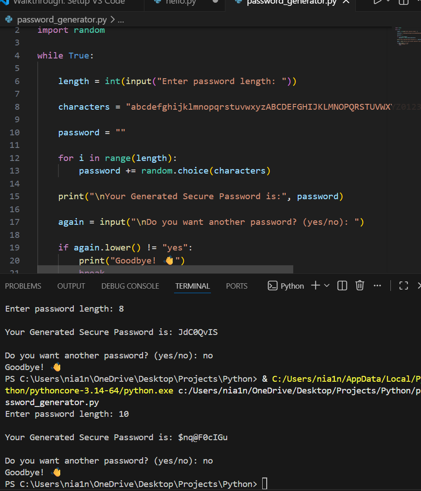

# Python Password Generator

This is a beginner Python project that generates secure random passwords.

## Features
- User chooses password length
- Random characters generation
- Includes letters, numbers and symbols

## Technologies
Python

